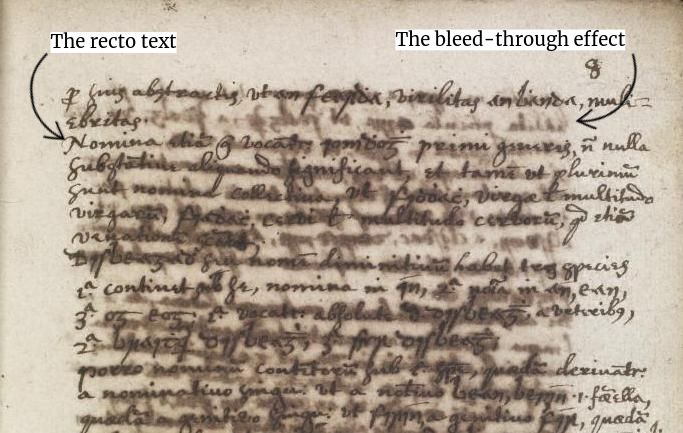

# ImageSeparationL2TI
This is the repository for the project Blind Source Separation with application to old document image restoration.

Old documents often suffer from two artifacts called show-through and bleed-through effects. 
Show-through is a front-to-back interference, mainly due to the scanning processand the transparency of the paper, which causes the text in the verso side of the documentto appear in the recto side (and vice versa). 
Bleed-through is a physical deteriorationdue to ink diffusion from one side of the paper to the other and produces an effect similarto that of show-through [3].

The main contributions of this work are the following:

* We develop a blind source separation framework, that encompasses several existing denoising approaches, in the context of document image restoration.
* The idea of using nonlocal characteristics of the image signal in this BSS scheme isproposed for the first time.
* A dictionary learning strategy to accelerate the algorithms which improves theseparation by considering the visual chirality of text images is proposed.

## The mixing model

A gray-scale image is represented as a matrix of dimensions n *x* n, where _n_ is the height and the width of the image. 
This matrix takes  values in the range [0, 1] and they represent the pixel intensities at each position.
We consider two gray-scale images of old documents of the same size, xr and xv, with _r_ denoting recto and _v_ denoting verso side.
The linear model with the matrix notations is formulated as follows:

x = As, 

where x = [xr, xv] is the vectorized recto and verso side of the observed mixture, s = [sr, sv] denotes the vectorized original front and back source,
 A is the mixing matrix.

We mixed our original sources using a rotation mixing matrix with an angle of 45 degrees and observed the behaviour various methods in separating the sources.

## FastICA experiments

We used the state-of-the-art ICA method to separate the mixtures of old documents. The results obtained are the foillowing:

  
   

  
  
  

## Our approach

The proposed Double Dictionary Learning approach seprarates the mixed sources better than FastICA. This can be seen qualitatively and quantitatively (Mean SSIM).

  
  

  
  
  

